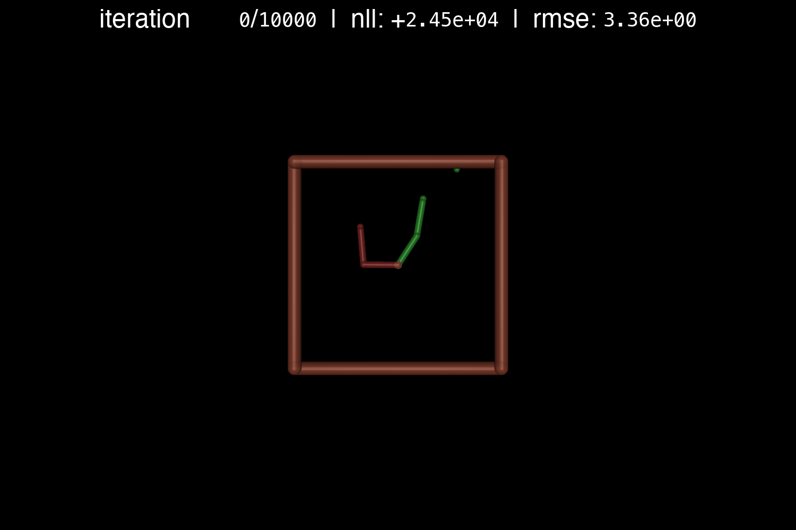
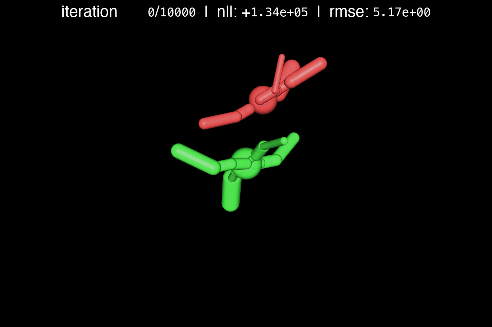

# Function Space Transfer of Probability Distributions

This work explores Bayesian neural networks whose prior lives in function space rather than weight space. We build this prior from a proxy of the data generating mechanism (for example a simulator or a nonparametric estimator) that supplies input and output samples, thereby inducing a stochastic process that places high mass on functions matching known behaviour. Training is therefore regularised where predictions live, transferring task structure such as smoothness, invariances, and characteristic scales directly into the posterior. Compared to standard weight-space priors, these functional models aim for better calibration, more reliable extrapolation, and improved data efficiency when weight priors are misspecified. We study this through FVI and FSVGD in comparison with VI and SVGD baselines.

> Work done as part of my Master's thesis at the [Learning and Adaptive Systems (LAS) Group](https://las.inf.ethz.ch/) at ETH Zurich. Supervisors: [Jonas Rothfuss](https://scholar.google.com/citations?user=EfLpX8QAAAAJ), [Andreas Krause](https://scholar.google.com/citations?user=eDHv58AAAAAJ). Full report: [`report.pdf`](report.pdf)

## Quick Start

Install dependencies with [uv](https://docs.astral.sh/uv/).

```bash
uv sync
```

## CLI

Run `uv run fpbnn -h` to see all options.

### Train

```bash
# Train specific model-environment combination
uv run fpbnn --model=fvi --env=hopper

# Train all models on an environment
uv run fpbnn --env=hopper

# Train multiple combinations
uv run fpbnn --model=fvi,svgd --env=densities,swimmer
```

### Tune

```bash
uv run fpbnn --model=fvi --env=hopper --tune --num-samples=20
```

### CLI Options (common)

- `--model`, `--env`: keys (comma-separated allowed).
- Training: `--n-iter`, `--batch-size`, `--learning-rate`, `--n-particles`.
- Data sizes: `--train-size`, `--test-size`.
- Reproducibility: `--seed`.
- Logging/plots: `--no-plot`, `--no-gif`, `--no-logging`, `--verbose`, `--verbose-ray`.
- Early stopping: `--no-early-stopping`, `--early-stopping-patience`, `--early-stopping-metric`, `--early-stopping-mode`, `--early-stopping-min-delta`.
- SSGE (functional methods): `--ssge-bandwidth`, `--ssge-n-eigen`, `--coeff-entropy`.
- Config behaviour: `--use-defaults` to ignore tuned configs.

### Available Models and Environments

- Models: `mlp`, `vi`, `svgd`, `fvi`, `fsvgd`.
- Environments: `sinusoids`, `densities`, `inverted_pendulum`, `swimmer`, `inverted_double_pendulum`, `reacher`, `hopper`, `half_cheetah`, `ant`.

### Outputs & Logging

- Per-run logs: `output/logs/<env>/<timestamp>/`.
- Per-run artefacts written by the CLI:
  - `results.yaml` (metrics)
  - `config.yaml` (final config used)
- Figures/GIFs: `output/figures/` and `output/gifs/`.
- Weights & Biases logging is enabled by default; disable with `--no-logging`.

### Hyperparameter Tuning Details

- `--tune` uses Ray Tune to search configs.
- Best configs are saved under `configs/<env>/<model>.yaml`.
- Aggregated results are saved under `output/results/<env>/<model>.csv`.

## Models & Environments

| Environment                       | MLP                                                  | VI                                                 | SVGD                                                   | FVI                                                  | FSVGD                                                    |
| --------------------------------- | ---------------------------------------------------- | -------------------------------------------------- | ------------------------------------------------------ | ---------------------------------------------------- | -------------------------------------------------------- |
| **Sinusoids (1D)**                |                 |                 |                 |                 |                 |
| **Densities (1D)**                |                 |                 |                 |                 |                 |
| **Inverted Pendulum (4D)**        |         |         |         |         |         |
| **Swimmer (8D)**                  |                   |                   |                   |                   |                   |
| **Inverted Double Pendulum (9D)** |  |  |  |  |  |
| **Reacher (10D)**                 |                   |                   |                   |                   |                   |
| **Hopper (11D)**                  |                    |                    |                    |                    |                    |
| **Half Cheetah (17D)**            |              |              |              |              |              |
| **Ant (105D)**                    |                       |                       |                       |                       |                       |

### Environment Details

- **Toy Problems**: Curve fitting with calibrated uncertainty.
- **Control Tasks**: Forward dynamics ($s_{t+1} | s_t, a_t$) learning from MuJoCo simulations.

## Reproducibility

- Use `--seed` to fix random seeds. The code enables deterministic TensorFlow operations where possible.

## Rendering & GIFs

- Plots and GIF creation are enabled by default; disable with `--no-plot`/`--no-gif`.
- For headless servers, set `MUJOCO_GL=egl` or `MUJOCO_GL=osmesa` to avoid OpenGL issues.

## Related Work

- Sun, S., Zhang, G., Shi, J., & Grosse, R. (2019). [Functional variational Bayesian neural networks.](https://arxiv.org/abs/1903.05779)
- Wang, D., Zeng, Z., & Liu, Q. (2019). [Stein variational gradient descent with matrix-valued kernels.](https://arxiv.org/abs/1902.09754)
- Liu, Q., & Wang, D. (2016). [Stein variational gradient descent: A general purpose bayesian inference algorithm.](https://arxiv.org/abs/1608.04471)
- Blundell, C., Cornebise, J., Kavukcuoglu, K., & Wierstra, D. (2015). [Weight uncertainty in neural networks.](https://arxiv.org/abs/1505.05424)

## Citation

If you use this work in your research, please cite:

```bibtex
@mastersthesis{pantalos2021function,
  title   = {Function Space Transfer of Probability Distributions},
  author  = {Pantalos, Georgios},
  school  = {ETH Zurich},
  address = {Zurich, Switzerland},
  year    = {2021},
  type    = {Master's thesis}
}
```

## License

MIT, see `LICENSE`.
